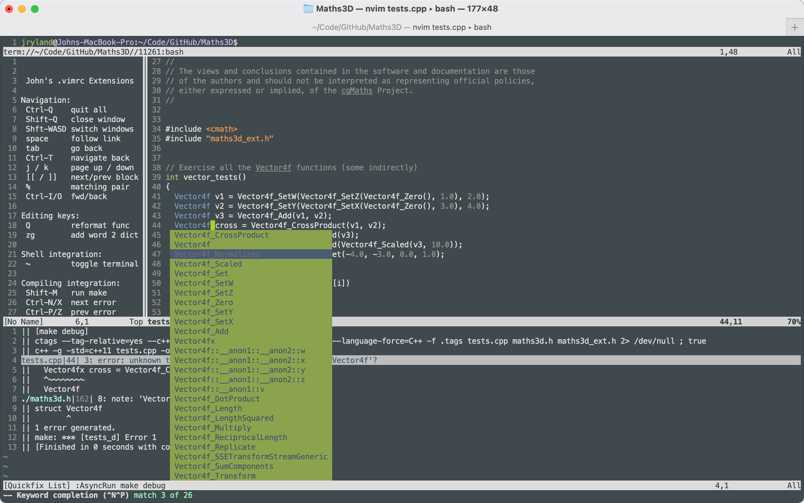
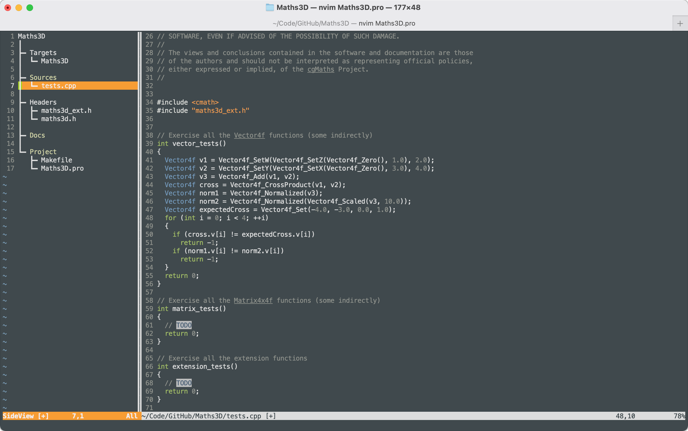

# VimSettings
Vim Settings

Check this out and then symlink the Vimrc file to ~/.vimrc to have the same settings I use.

Assumes various vim plugins/extensions etc are installed in your ~/.vim which should contain these directories if they are installed:

```
  .vim/plugged/vim-easy-align
  .vim/plugged/asyncrun.vim
  .vim/plugged/lldb.nvim
  .vim/spell
  .vim/tags/cpp_src
  .vim/colors
  .vim/autoload/omni
  .vim/after/ftplugin
```

Inside vim, you can type `:Help` to display some of the commands this adds that I commonly use. Try typing `~`, and `~` to close it again :)

### Auto-completion

When typing, pressing tab can bring up a list of auto-completions.




### Project Integration

If using these Vim extensions in-conjunction with the GenericMakefile which can be used to build your project, you will be able to have a
project tree view to the side which when highlighting an item and press `<Enter>` will open that file.




## Some helpful commands:

- Type `:Help` to get the list of commands/key-binds as shown in the left panel.
- Type `~` to expand or collapse the terminal panel across the top.
- Type `<Shift>+R` to Run which will execute 'make debug' and display the output in the quickfix output panel across the bottom.
- Type `<Ctrl>+N` and `<Ctrl>+P` to move to the next and previous errors/output in the quickfix view (anything matching filename:line).
- The editing panel on the right is syntax highlighting and using the tags file generated by the Makefile to highlight symbols.
- Pressing `<Tab>` shows the completion list as shown.


## Neovim setup

Save this to ~/.config/nvim/init.lua

```
-- vim.fn.system({'git', 'clone', 'https://github.com/JohnRyland/VimSettings', vim.fn.stdpath('data') .. '/personal'})
vim.fn.system({'git', 'clone', 'git@github.com:JohnRyland/VimSettings.git', vim.fn.stdpath('data') .. '/personal'})
vim.opt.rtp:prepend(vim.fn.stdpath('data') .. '/personal')
require("personal")
```

Restart running it a few times to complete the set up

